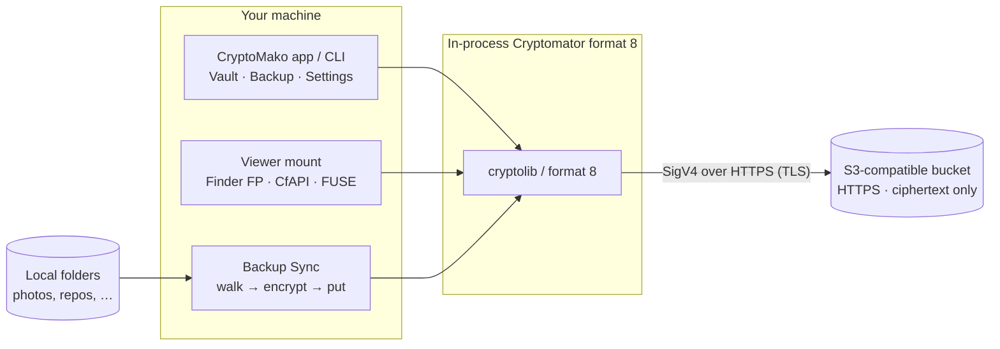

# CryptoMako

[](LICENSE)
[](https://github.com/guillebot/cryptomako)
[](https://github.com/guillebot/cryptomako-ios)
[](https://github.com/guillebot/cryptomako)
[](https://cryptomator.org)
[](https://github.com/guillebot/cryptomako/releases)

**CryptoMako puts a [Cryptomator](https://cryptomator.org) format‑8 vault on any S3‑compatible bucket** — then unlocks it so you work with plaintext locally while the object store only ever sees opaque ciphertext (names and contents).

One vault format, one security model, across:

| Family | Where | Surfaces |
|--------|-------|----------|
| **Desktop (this repo)** | **macOS** (repo root), **Windows** (`windows/`), **Linux** (`linux/`) | App / CLI + viewer mount + **Backup Sync** for bulk |
| **iOS** | [guillebot/cryptomako-ios](https://github.com/guillebot/cryptomako-ios) | Sibling app |
| **Android** | [guillebot/cryptomako-android](https://github.com/guillebot/cryptomako-android) | Sibling app |

Not a Cryptomator fork — ciphertext stays on the bucket; decryption is in‑process. Licensed **AGPLv3** (including paid distribution).

## Release ([v1.0.0](https://github.com/guillebot/cryptomako/releases/tag/v1.0.0))

| Platform | Status |
|----------|--------|
| **Linux** | `.deb` attached (`cryptomako_1.0.0_amd64.deb`) — CLI + FUSE + Backup Sync |
| **macOS** | Notarized zip/dmg pending Apple Notary (attach to the same tag when ready) |
| **Windows** | In‑repo under `windows/` (.NET 8 CLI, Avalonia desktop, CfAPI); **no installer** in this release |

```bash
# Linux
sudo dpkg -i cryptomako_1.0.0_amd64.deb
```

## What it does

| Capability | What you get |
|------------|----------------|
| **S3 vault** | Connect over **HTTPS** to AWS S3, MinIO, or any SigV4 S3 API. Vault objects live under a bucket prefix you choose; the bucket never sees cleartext names or contents. |
| **Cryptomator format 8** | Password unlock (macOS: `cryptolib-swift`; Linux/Windows: native format‑8 stacks). Vaults stay interoperable with stock Cryptomator. |
| **Viewer mount** | Browse + light create/delete: **Finder File Provider** (macOS), **CfAPI / Cloud Files** (Windows), **FUSE** (Linux). Fail‑closed remote writes. |
| **Backup Sync** | Bulk backup of large trees: walk → encrypt → put (parallel uplink), with optional bandwidth cap, proxy, and excludes (`node_modules`, `.git`, …). |

**Durable store = remote ciphertext only.** Local CloudStorage / hydrate / FUSE materialization is never treated as “backed up.”

## Desktop layout (this repository)

```text
cryptomako/
├── Sources/ … Support/ …     # macOS (Swift) — app, File Provider, CLI
├── linux/                    # Linux (Go) — CLI, FUSE, Backup Sync, .deb packaging
├── windows/                  # Windows (.NET 8) — CLI, Avalonia desktop, CfAPI (when merged)
└── fixtures/                 # Shared golden format‑8 vault
```

| OS | Tree | Viewer mount | Bulk path |
|----|------|--------------|-----------|
| macOS | repo root | Finder File Provider (+ optional macFUSE sync volume) | Backup Sync |
| Windows | `windows/` | Explorer CfAPI / Cloud Files | Backup Sync |
| Linux | [`linux/`](linux/) | FUSE (`mount`, default ro / optional `--rw`) | Backup Sync (`sync` / `sources`) |

See [`linux/README.md`](linux/README.md) for the Linux tree. The Windows tree (`windows/`) ships CLI + Avalonia desktop + CfAPI on the Windows development branches; it is not required to use the Linux `.deb` or macOS app.

## Architecture




### Roles (important split)

| Surface | Role |
|---------|------|
| **Backup Sync** | Bulk backup of large trees. Prefer this for multi‑GB / many-file jobs. |
| **Viewer mount** (Finder FP / CfAPI / FUSE) | Browse + small ad‑hoc transfers. Do **not** point rclone or bulk tools at the CloudStorage / hydrate path. |
| **Optional cleartext FUSE** (macOS macFUSE / Linux `mount`) | Tool‑friendly sync volume; still encrypts before remote put. |

## Security model (short)

- **Transport:** all S3 traffic is **HTTPS (TLS)**. Plain HTTP is rejected on supported paths.
- **At rest in the bucket:** data is **100% unrecognizable**. Neither file **contents** nor cleartext **names** appear in the object store — only Cryptomator ciphertext and encrypted directory layout (`d/…/*.c9r`, etc.).
- Masterkey material is encrypted; unlocking stays on your device.
- Secrets live in the Keychain / Credential Manager / env vars — **never** in `settings.json` / `poc.json` / `config.json`.
- Writes **fail closed** unless the remote object put/delete succeeds.

## Sibling apps (mobile)

- **iOS:** [github.com/guillebot/cryptomako-ios](https://github.com/guillebot/cryptomako-ios)
- **Android:** [github.com/guillebot/cryptomako-android](https://github.com/guillebot/cryptomako-android)

Same format‑8 vault on the same bucket — unlock on phone or desktop interchangeably.

## macOS (this tree)

### Requirements

- macOS 14+
- Swift 5.10+ / Xcode 16+
- [xcodegen](https://github.com/yonaskolb/XcodeGen) (`.xcodeproj` is generated from `project.yml`)
- Apple Developer Program membership for File Provider + App Groups
- Docker optional (local MinIO via `./scripts/minio-up.sh`)

No AWS SDK: S3 is SigV4‑signed in‑process over an ephemeral `URLSession` (no `URLCache`). Dependencies: `cryptolib-swift`, `base32`, `swift-argument-parser`.

### Build

```bash
cd ~/dev/cryptomako
swift build
swift run cryptomako --help
swift test
make ci
make security   # Trivy + Grype

# Local vault, no S3:
swift run cryptomako fixture
export CRYPTOMAKO_PASSWORD="$(tr -d '\n' < fixtures/PASSWORD)"
swift run cryptomako ls --local fixtures/vault --path / --recursive

# Signed app + File Provider:
xcodegen generate
xcodebuild -project CryptoMako.xcodeproj -scheme CryptoMako \
  -configuration Debug -destination 'platform=macOS' build
open ~/Library/Developer/Xcode/DerivedData/CryptoMako-*/Build/Products/Debug/CryptoMako.app
```

### App tabs

1. **Vault** — Local or S3 connection, unlock, listing, Mount in Finder.
2. **Backup** — Folder picker, Sync progress, live bandwidth.
3. **Settings** — HTTP(S) proxy, optional Sync Mbps cap, Sync path excludes.

S3 settings need endpoint, region, bucket, **vault prefix** (folder containing `vault.cryptomator`), and access key. Prefix example: `cryptomako-poc/`. Empty prefix = bucket root.

### CLI quick path

Config: `~/.config/cryptomako/poc.json` (and app‑group `settings.json`). No secrets in JSON:

```json
{
  "storageMode": "s3",
  "endpoint": "https://your-minio-host:9000",
  "region": "us-east-1",
  "bucket": "your-bucket",
  "prefix": "cryptomako-poc/",
  "accessKey": "your-access-key"
}
```

```bash
export CRYPTOMAKO_SECRET_KEY='...'
export CRYPTOMAKO_PASSWORD='your-vault-password'

swift run cryptomako unlock --prefix cryptomako-poc/
swift run cryptomako ls --prefix cryptomako-poc/ --path / -R
swift run cryptomako cat --prefix cryptomako-poc/ /hello.txt
```

### File Provider mount

After Unlock + **Mount in Finder**:

```text
~/Library/CloudStorage/CryptoMako-CryptoMako
```

See [docs/30-m2-file-provider.md](docs/30-m2-file-provider.md) and [docs/60-backup-fuse-rclone.md](docs/60-backup-fuse-rclone.md).

## Linux (`linux/`)

Go CLI + FUSE cleartext mount + Backup Sync. Shared `fixtures/` golden vault.

```bash
cd linux
go test ./...
go build -o cryptomako .
# or: ./packaging/build-deb.sh  →  sudo dpkg -i packaging/dist/cryptomako_*.deb
```

Details: [`linux/README.md`](linux/README.md).

## Windows (`windows/`)

.NET 8 CLI, Avalonia desktop (Vault / Backup / Settings + tray), and Explorer **CfAPI** viewer mount, plus Backup Sync. HTTPS‑only S3; secrets via env / Credential Manager — never JSON. Build from that tree with the .NET 8 SDK (`dotnet build` / `dotnet test`). No Windows installer ships in [v1.0.0](https://github.com/guillebot/cryptomako/releases/tag/v1.0.0).

## Documentation

| Doc | Contents |
|-----|----------|
| [docs/00-product.md](docs/00-product.md) | Thesis, naming, out of scope |
| [docs/10-m0-fixture.md](docs/10-m0-fixture.md) | MinIO + Cryptomator fixture |
| [docs/20-m1-cli.md](docs/20-m1-cli.md) | CLI contract |
| [docs/30-m2-file-provider.md](docs/30-m2-file-provider.md) | Finder extension |
| [docs/40-m3-writes.md](docs/40-m3-writes.md) | Writes + Cryptomator health check |
| [docs/50-security.md](docs/50-security.md) | Secrets, logging, threat model |
| [docs/60-backup-fuse-rclone.md](docs/60-backup-fuse-rclone.md) | Backup Sync vs Finder |
| [docs/architecture/overview.md](docs/architecture/overview.md) | Modules, unlock, listing |
| [linux/README.md](linux/README.md) | Linux CLI / FUSE / `.deb` |
| [BREAK_GLASS.md](BREAK_GLASS.md) | Emergency wipe |

## License

[GNU Affero General Public License v3.0](LICENSE). You may charge for copies or access; recipients retain AGPL rights to corresponding source and to run modified versions. CryptoMako links [`cryptolib-swift`](https://github.com/cryptomator/cryptolib-swift) on macOS (also AGPLv3) — compatible while CryptoMako stays AGPL.

## Identifiers (macOS)

| Item | Value |
|------|--------|
| Bundle ID | `net.gschimmel.cryptomako` |
| Extension | `net.gschimmel.cryptomako.FileProvider` |
| App Group (runtime) | `{TEAM_ID}.group.net.gschimmel.cryptomako` |
| Keychain service | `net.gschimmel.cryptomako` |
