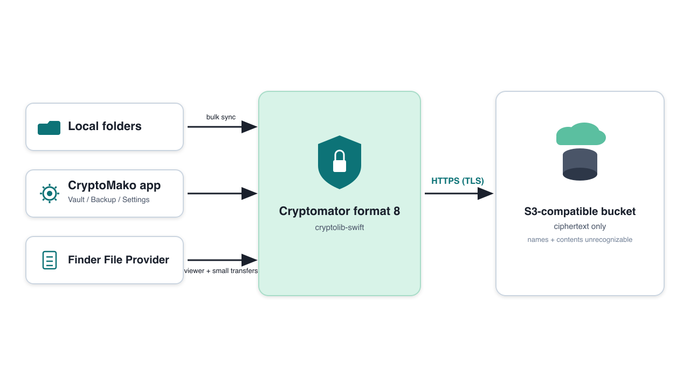
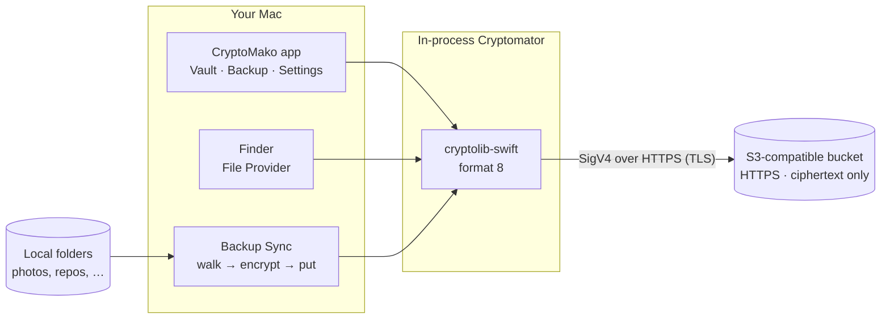

# CryptoMako

[](LICENSE)
[](https://github.com/guillebot/cryptomako)
[](https://swift.org)
[](https://github.com/guillebot/cryptomako)
[](https://cryptomator.org)
[](https://github.com/guillebot/cryptomako/releases)


**Point CryptoMako at any S3-compatible bucket, unlock a [Cryptomator](https://cryptomator.org) vault, and work with your files as plaintext** — in the app, in Finder, and through high-throughput Backup Sync for large trees.

CryptoMako is a macOS companion, not a Cryptomator fork. Ciphertext stays on the object store; decryption happens in-process. Licensed under **AGPLv3** (including paid distribution).

## What it does

| Capability | What you get |
|------------|----------------|
| **S3 vault** | Connect over **HTTPS** to AWS S3, MinIO, or any SigV4 S3 API. Vault objects live under a bucket prefix you choose; the bucket never sees cleartext names or contents. |
| **Cryptomator format 8** | Password unlock with `cryptolib-swift`. Vaults stay interoperable with stock Cryptomator (Directory Health Check clean). |
| **App listing** | SwiftUI host: unlock, status lamps (S3 / vault / Finder), browse cleartext names, small transfers. |
| **Finder File Provider** | Mount the vault under Finder → Locations for browsing and light create/delete. Fail-closed: remote S3 put/delete must succeed. |
| **Backup Sync** | Pick big local folders and sync them into the vault over a saturated uplink (parallel encrypt → S3 put), with optional bandwidth cap, proxy, and excludes (`node_modules`, `.git`, …). |

**Durable store = remote ciphertext only.** Local CloudStorage materialization is never treated as “backed up.”

## Architecture





```text
  Local disk                              Object store (HTTPS / TLS)
 ───────────                              ─────────────────────────
  ~/Photos ──┐
  ~/dev ─────┼──► Backup Sync ──► encrypt ──► s3://bucket/prefix/d/…/*.c9r
             │                      ▲              ↑
  Finder ◄───┴── File Provider ─────┘              names + contents
                      │                            unrecognizable
                 CryptoMako app
```

### Roles (important split)

| Surface | Role |
|---------|------|
| **Backup tab → Sync** | Bulk backup of large trees. Prefer this for multi‑GB / many-file jobs. |
| **Finder File Provider** | Viewer + small ad-hoc transfers. Do **not** point rclone or bulk tools at `~/Library/CloudStorage/CryptoMako-*`. |
| **Optional cleartext macFUSE** | `/Volumes/CryptoMakoSync` for tool-friendly sync; still encrypts before remote put. |

## Security model (short)

- **Transport:** all S3 traffic is **HTTPS (TLS)**. Plain HTTP is not the supported path (App Transport Security in the sandboxed app and extension).
- **At rest in the bucket:** data is **100% unrecognizable**. Neither file **contents** nor cleartext **names** appear in the object store — only Cryptomator ciphertext and encrypted directory layout (`d/…/*.c9r`, etc.).
- Masterkey material is encrypted; unlocking stays on your Mac.
- Secrets live in the Keychain (app) or env vars (CLI) — never in `settings.json` / `poc.json`.
- Writes fail closed unless the remote object put/delete succeeds.

## Requirements

- macOS 14+
- Swift 5.10+ / Xcode 16+
- [xcodegen](https://github.com/yonaskolb/XcodeGen) (`.xcodeproj` is generated from `project.yml`)
- Apple Developer Program membership for File Provider + App Groups
- Docker optional (local MinIO via `./scripts/minio-up.sh`)

No AWS SDK: S3 is SigV4-signed in-process over an ephemeral `URLSession` (no `URLCache`). Dependencies: `cryptolib-swift`, `base32`, `swift-argument-parser`.

## Build

```bash
cd ~/dev/cryptomako
swift build
swift run cryptomako --help
swift test
make ci
make security   # Trivy + Grype

# Local vault, no S3:
swift run cryptomako fixture
export CRYPTOMAKO_PASSWORD="$(tr -d '\n' < fixtures/PASSWORD)"
swift run cryptomako ls --local fixtures/vault --path / --recursive

# Signed app + File Provider:
xcodegen generate
xcodebuild -project CryptoMako.xcodeproj -scheme CryptoMako \
  -configuration Debug -destination 'platform=macOS' build
open ~/Library/Developer/Xcode/DerivedData/CryptoMako-*/Build/Products/Debug/CryptoMako.app
```

## App tabs

1. **Vault** — Local or S3 connection, unlock, listing, Mount in Finder.
2. **Backup** — Folder picker, Sync progress, live bandwidth.
3. **Settings** — HTTP(S) proxy, optional Sync Mbps cap, Sync path excludes.

S3 settings need endpoint, region, bucket, **vault prefix** (folder containing `vault.cryptomator`), and access key. Prefix example: `cryptomako-poc/`. Empty prefix = bucket root.

## CLI quick path

Config: `~/.config/cryptomako/poc.json` (and app-group `settings.json`). No secrets in JSON:

```json
{
  "storageMode": "s3",
  "endpoint": "https://your-minio-host:9000",
  "region": "us-east-1",
  "bucket": "your-bucket",
  "prefix": "cryptomako-poc/",
  "accessKey": "your-access-key"
}
```

```bash
export CRYPTOMAKO_SECRET_KEY='...'
export CRYPTOMAKO_PASSWORD='your-vault-password'

swift run cryptomako unlock --prefix cryptomako-poc/
swift run cryptomako ls --prefix cryptomako-poc/ --path / -R
swift run cryptomako cat --prefix cryptomako-poc/ /hello.txt
```

## File Provider mount

After Unlock + **Mount in Finder**:

```text
~/Library/CloudStorage/CryptoMako-CryptoMako
```

See [docs/30-m2-file-provider.md](docs/30-m2-file-provider.md) and [docs/60-backup-fuse-rclone.md](docs/60-backup-fuse-rclone.md).

## Documentation

| Doc | Contents |
|-----|----------|
| [docs/00-product.md](docs/00-product.md) | Thesis, naming, out of scope |
| [docs/10-m0-fixture.md](docs/10-m0-fixture.md) | MinIO + Cryptomator fixture |
| [docs/20-m1-cli.md](docs/20-m1-cli.md) | CLI contract |
| [docs/30-m2-file-provider.md](docs/30-m2-file-provider.md) | Finder extension |
| [docs/40-m3-writes.md](docs/40-m3-writes.md) | Writes + Cryptomator health check |
| [docs/50-security.md](docs/50-security.md) | Secrets, logging, threat model |
| [docs/60-backup-fuse-rclone.md](docs/60-backup-fuse-rclone.md) | Backup Sync vs Finder |
| [docs/architecture/overview.md](docs/architecture/overview.md) | Modules, unlock, listing |
| [BREAK_GLASS.md](BREAK_GLASS.md) | Emergency wipe |

## License

[GNU Affero General Public License v3.0](LICENSE). You may charge for copies or access; recipients retain AGPL rights to corresponding source and to run modified versions. CryptoMako links [`cryptolib-swift`](https://github.com/cryptomator/cryptolib-swift), also AGPLv3 — compatible while CryptoMako stays AGPL.

## Identifiers

| Item | Value |
|------|--------|
| Bundle ID | `net.gschimmel.cryptomako` |
| Extension | `net.gschimmel.cryptomako.FileProvider` |
| App Group (runtime) | `{TEAM_ID}.group.net.gschimmel.cryptomako` |
| Keychain service | `net.gschimmel.cryptomako` |
