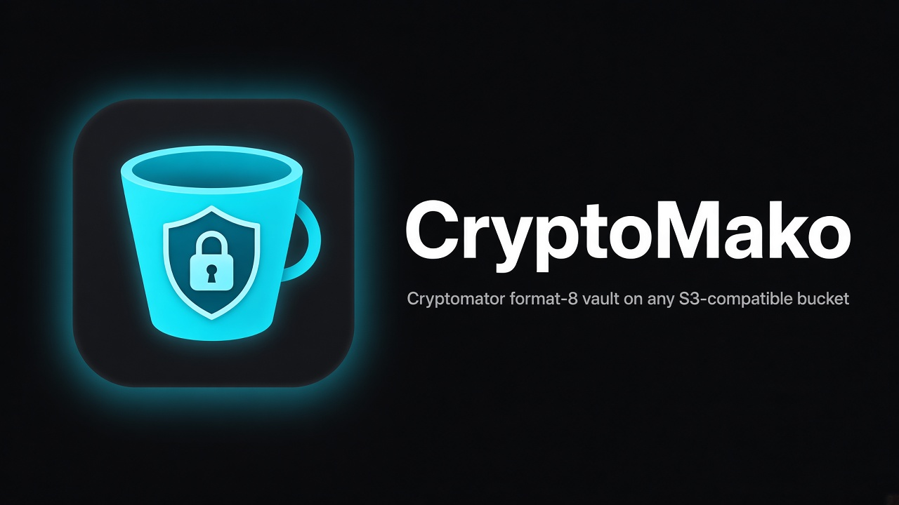

# CryptoMako Windows



Windows port of [CryptoMako](https://github.com/guillebot/cryptomako): S3-compatible bucket → Cryptomator **format 8** vault over HTTPS, cleartext UX locally, unrecognizable names+contents in the bucket.

**Product display name:** CryptoMako (C+M). CLI/package id: `cryptomako` (lowercase).

**Brand:** single canonical mark from [`docs/assets/brand/`](../docs/assets/brand/) — Desktop tray/app icons come from `tray-windows.png` / `icon-*.png` (converted to `Assets/tray.ico` + `Assets/AppIcon.ico`). Do not invent alternate marks.


## Surfaces (locked)

| Surface | Role |
|---------|------|
| **Explorer (CfAPI / Cloud Files)** | Browse + small transfers. Local materialization is **never** “backed up.” |
| **Backup Sync** | Large trees: walk → encrypt → remote put. Fail-closed. |

## Requirements

- .NET 8 SDK (Desktop: Windows + Windows App SDK via NuGet; unpackaged)
- Vault password in `CRYPTOMAKO_PASSWORD` (never argv; never JSON)
- S3 secret in `CRYPTOMAKO_SECRET_KEY` (Credential Manager later)
- S3 endpoints **https only** (http rejected)

## Build

```bash
cd windows
export PATH="$HOME/.dotnet:$PATH"   # macOS/Linux host
dotnet build
dotnet test
```

## Local golden vault

```bash
export CRYPTOMAKO_PASSWORD="$(tr -d '\n' < ../fixtures/PASSWORD)"
dotnet run --project src/CryptoMako.Cli -- unlock --local ../fixtures/vault
dotnet run --project src/CryptoMako.Cli -- ls --local ../fixtures/vault --path / -R
dotnet run --project src/CryptoMako.Cli -- cat --local ../fixtures/vault /hello.txt
dotnet run --project src/CryptoMako.Cli -- get --local ../fixtures/vault /hello.txt -o /tmp/hello.txt
dotnet run --project src/CryptoMako.Cli -- stat --local ../fixtures/vault /hello.txt
```

## S3 / MinIO (no live bucket required for unit tests)

```bash
export CRYPTOMAKO_PASSWORD='…'
export CRYPTOMAKO_SECRET_KEY='…'
dotnet run --project src/CryptoMako.Cli -- unlock \
  --endpoint https://minio.example:9000 \
  --region us-east-1 \
  --bucket vaults \
  --prefix team/demo/ \
  --access-key minio \
  # path-style by default; add --virtual-hosted for AWS-style URLs

dotnet run --project src/CryptoMako.Cli -- ls \
  --endpoint https://minio.example:9000 --bucket vaults --prefix team/demo/ \
  --access-key minio --path / -R
```

Or put non-secret fields in `%AppData%/CryptoMako/settings.json` / `~/.config/cryptomako/poc.json`:

```json
{
  "storageMode": "s3",
  "endpoint": "https://minio.example:9000",
  "region": "us-east-1",
  "bucket": "vaults",
  "prefix": "team/demo/",
  "accessKey": "minio",
  "localVaultPath": "",
  "autoReconnect": false,
  "pathStyle": true
}
```

Then: `cryptomako unlock --config /path/to/settings.json`

## Settings keys (Platforms-locked — do not invent)

**VaultSettings:** `storageMode`, `endpoint`, `region`, `bucket`, `prefix`, `accessKey`, `localVaultPath`, `autoReconnect`, `pathStyle`

**AppPreferences:** `proxyMode`, `proxyHost`, `proxyPort`, `proxyUsername`, `limitSyncUploadBandwidth`, `syncUploadCapMbps`, `syncSmallPutConcurrency`, `syncMediumPutConcurrency`, `syncLargePutConcurrency`

**Excludes:** `directoryNames`, `fileNames`, `fileExtensions`

Secrets: env / Credential Manager only.

## Desktop + CfAPI

- **Desktop (WinUI 3) + tray:** `dotnet run --project src/CryptoMako.Desktop -c Release -p:Platform=x64` — Vault / Backup / Settings; status strip + tray unlock/lock/probe/open/quit (close/minimize hide to tray). See `docs/desktop.md`.
- **CfAPI:** `cryptomako cfapi register|unregister` live on Windows 11; Connect/hydrate still blocked (`docs/cfapi.md`).
- **Parity checklist:** `docs/parity.md` · packaging: `docs/packaging.md`.
- **Credentials CLI:** `cryptomako cred list|get|set|delete` (stdin for set; `get` needs `--reveal`; Credential Manager on Windows).

## Backup Sync

Nested/overlapping sources: soft-warn on add, hard-fail on Sync — see [`docs/backup-sources.md`](docs/backup-sources.md).


```bash
dotnet run --project src/CryptoMako.Cli -- sync --local ../fixtures/vault \
  --source /path/to/cleartext --vault-folder MyHost
# uploads under /Backups/MyHost/… with excludes + size-tiered put workers
```

Workers / bandwidth / proxy: `%AppData%/CryptoMako/app-preferences.json` (Platforms-locked keys).
Secrets: env or Windows Credential Manager (`CryptoMako/CRYPTOMAKO_*`). Lock clears in-process passphrase UI + zeros masterkey / drops S3 secret ref (CredMan wipe deferred; see `docs/desktop.md`).

## Acceptance

- `dotnet test` green (golden + SigV4 + settings + Backup Sync + proxy mapping)
- Local CLI matches `fixtures/expected-ls.txt` and hello.txt
- S3 client: get/list/put/delete over HTTPS with SigV4; unlock/ls/cat/get/stat/sync/delete/rename/mkdir/put wired
- autoReconnect connectivity monitor (Desktop); parity checklist: `docs/parity.md`
- Proxy modes system|direct|custom applied to S3 HttpClient

## Soft release / remaining

See **`docs/parity.md`**. Soft release surfaces (unlock, Backup Sync, settings keys, CredMan, tray, CLI, soft CfAPI viewer) are in place on Windows.

Deferred (not soft blockers): conflict/remote watcher, Forget-credentials wipe, update checker, transfer metrics, MSIX store listing — see parity.md.

Non-CfAPI library/CLI paths also build on Mac hosts; **Desktop is Windows-only (WinUI 3)**. Mac builds of `CryptoMako.CfApi` are stubs only.


## License

AGPL-3.0 (same as the parent repo).

## Publish (win-x64)

```powershell
cd windows
pwsh ./scripts/publish-win-x64.ps1
```

See [`docs/packaging.md`](docs/packaging.md).

